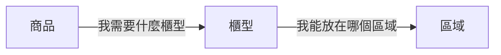
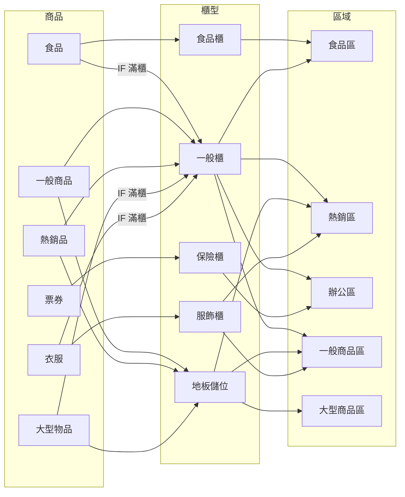

想像大賣場裡，冷凍食品有冷凍區、零食會放在同一區方便挑選——倉庫上架也是類似的判斷，只是更複雜：什麼商品該放什麼櫃型、哪個區域適合放什麼類型，這些判斷大多鎖在資深上架人員的腦袋裡。新人來了只能跟著學，SOP 再多也記不住，結果不是卡住等人判斷，就是隨便找個空位塞進去，造成後續出貨效率下降

為了增加效率也減少新人上手的痛苦程度，我們決定讓系統來做最基本的判斷：根據商品特性和材積大小自動推薦合適的櫃型，只有系統無法處理的複雜情境才需要請資深上架人員出手

那系統要怎麼判斷？拆開來看，倉庫裡本來就有三個獨立的角色——商品、櫃型、區域——各自有各自的限制，只是過去全部混在人的判斷裡。把它們分開描述自己，再用一個配對引擎兜起來：



新增一種商品類型？告訴系統「我需要什麼」就好，不用改任何既有程式碼

要理解為什麼這樣設計，得先看看最直覺的做法會踩到什麼坑

## 最直覺的做法：寫死的配對規則

大部分人第一反應會這樣寫：

```php
function recommendShelves(Product $product): array
{
    if ($product->type === '食品') {
        if ($product->width <= 40 && $product->height <= 40) {
            return ['zone' => '食品區', 'shelf' => '食品櫃'];
        }
        return ['zone' => '食品區', 'shelf' => '一般櫃'];
    }

    if ($product->type === '票券') {
        return ['zone' => '辦公區', 'shelf' => '保險櫃'];
    }

    if ($product->type === '大型物品') {
        if ($product->volume > 60) {
            return ['zone' => '大型商品區', 'shelf' => '地板儲位'];
        }
        return ['zone' => '大型商品區', 'shelf' => '一般櫃'];
    }

    // ... 無窮無盡的 if-else
    // 每種商品 × 每種材積 × 每種櫃型 × 每個區域 = ?
}
```

這還只是商品對櫃型的判斷。加上「這個商品能不能進這個區域」的限制，實際的對應關係長這樣：



每加一種商品，這張圖就再亂一點。而這些全部要用 if-else 寫出來

這種寫法有三個痛點：

* **定位困難** 光是 PM 詢問某個商品為什麼不能放在 XX 櫃型，整理程式碼現況 + 實測商品/櫃型狀況可能就要花上大半天，還不一定能確認是設定問題還是 bug ，最後只好埋個 log 下次再追

* **影響範圍不可控** 在第 50 行加一個條件，可能影響到第 200 行的邏輯。即使嘗試用一些 function 隔離，也會因為一些特例需要跨 function 的判斷造成邊界混亂

* **測試組合爆炸** 3 種商品 × 5 種櫃型 × 2 個區域 = 30 種組合。多加一種商品就變 40 種，多加一種櫃型變 48 種。每次改動測不完所有組合，上線後只能祈禱


## 退一步想：這三件事本來就是獨立的

讓我從實體倉庫的角度重新看這個問題

區域有自己的限制——不同區域有不同的環境條件和動線考量，不是每個區域都接受所有商品。櫃型有自己的限制——格位大小、能放在哪些區域。商品也有自己的限制——材積、類型、存放需求。像是同一種一般櫃可以放在食品區也可以放在一般區，但食品不該被放進辦公區的一般櫃裡

它們各自有獨立的屬性，只是最後需要有人把它們配在一起

問題就出在：我們把「配對邏輯」跟「各自的屬性定義」混在一起了。那一坨 if-else 同時在做兩件事——描述商品需要什麼，以及決定怎麼配對

而且換個思路——與其讓程式碼直接吐一個答案，去查詢後發現都滿了不能用還需要額外錯誤處理，不如先找出所有「能放的地方」，再從裡面挑最好的

拆開來就對了

## 讓每個角色自己說話

先定義每個角色需要描述什麼：

```php
interface ProductType
{
    /** 我需要什麼櫃型 */
    public function requirements(): array;
}

interface ShelfType
{
    /** 我能放在哪些區域 */
    public function allowedZones(): array;
}

interface Zone
{
    /** 我接受什麼類型的商品 */
    public function acceptedProductTypes(): array;
}
```

三個 interface 就把整個系統的角色說清楚了。接著每個類型只要實作自己的描述：

```php
class Food implements ProductType
{
    public function requirements(): array { return [FoodShelf::class, GeneralShelf::class]; }
}

class FoodShelf implements ShelfType
{
    public function allowedZones(): array { return [FoodZone::class]; }
}

class FoodZone implements Zone
{
    public function acceptedProductTypes(): array { return [Food::class]; }
}
```

商品說「我能去哪些櫃型」，櫃型說「我能放在哪些區域」，區域說「我接受什麼商品」。每個 class 只負責自己的規則，尺寸由實體自己帶

配對引擎對外只有一個接口：

```php
function resolveShelfCriteria(Product $product): array
{
    $shelfTypes = $product->type()->requirements();
    $result = [];

    foreach ($shelfTypes as $shelfType) {
        foreach ((new $shelfType)->allowedZones() as $zoneClass) {
            $zone = new $zoneClass;
            if (in_array($product->type()::class, $zone->acceptedProductTypes())) {
                $result[] = ['shelfType' => $shelfType, 'zone' => $zoneClass];
            }
        }
    }

    return $result;
}
```

從商品出發：先問 `requirements()` 知道能去哪些櫃型，再從那些櫃型的 `allowedZones()` 推出可接受的區域，最後由區域的 `acceptedProductTypes()` 確認自己接不接受這個商品。整個過程都是純規則推導，不需要額外查詢儲位資料

## 實作：兩階段驗證

解耦解決了擴展性的問題，但實際跑起來還有效能要顧——不能每次都把所有儲位從資料庫撈出來比對。所以實際流程分兩階段：

* **第一階段：規則推導（記憶體操作）**
    1. 從商品的 `requirements()` 取得可接受的櫃型
    2. 從那些櫃型的 `allowedZones()` 取得可接受的區域
    3. 區域再確認：`acceptedProductTypes()` 接不接受這個商品？篩掉不相容的組合

* **第二階段：資料庫查詢 + 尺寸比對（I/O 操作）**
    1. 用櫃型 + 區域條件查詢實體儲位，依距離和擁擠度排序
    2. 逐一比對尺寸：商品放得進這個格位嗎？

重點是：記憶體裡只存規則，不載入具體儲位資料。先用規則篩掉不可能的組合，確定能配對了，才進資料庫撈實體儲位。不必要的 I/O 全部省掉

## 這樣改之後
這樣的建模同時也服務了現場的物流人員——程式碼裡的「商品需要什麼櫃型」「櫃型能放在哪個區域」跟他們日常的用語是同一套，溝通需求時不需要翻譯

舉個例子：今天要新增「雨傘」類型，只需要問物流人員這類型需要放在什麼櫃型，即使是新人工程師也能輕鬆上手完成這個需求：

```php
class Umbrella implements ProductType
{
    public function requirements(): array { return [UmbrellaStand::class]; }
}
```

不用打開任何既有的 if-else，不用改動食品或大型物品的邏輯。配對引擎會自動根據 `requirements()` 找到匹配的櫃型

新增櫃型也一樣——傘架還不存在？加一個 class 就好：

```php
class UmbrellaStand implements ShelfType
{
    public function allowedZones(): array { return [GeneralZone::class]; }
}
```

不用回頭改商品的程式碼

測試也變簡單了——每個類型獨立測試自己的定義，配對引擎只測比對邏輯。從「每次改動都要回歸所有組合」變成「只測你改的那個 class」

上面的雨傘就是個真實案例——第一次接觸這個專案的工程師接到這個需求，回饋是「很好改」。如果是一坨 if-else，光是定位和理解現有邏輯大概就要花上一兩天

## 但這不是銀彈

這個設計把複雜度從「一坨 if-else」搬到了「每個 class 的設定正確性」。如果某個 ProductType 的 `requirements()` 寫錯了，你不會在配對引擎裡看到錯誤——它只是默默配不上，debug 時要回頭檢查每個角色的自我描述是否正確

換句話說：if-else 的問題是「改不動」，這個設計的問題是「設定錯了不容易發現」。所以每個類型的單元測試不是可有可無，而是必要的防護網

## 最後

核心就一句話：讓每個模組只需要認識自己，配對的事交給引擎
