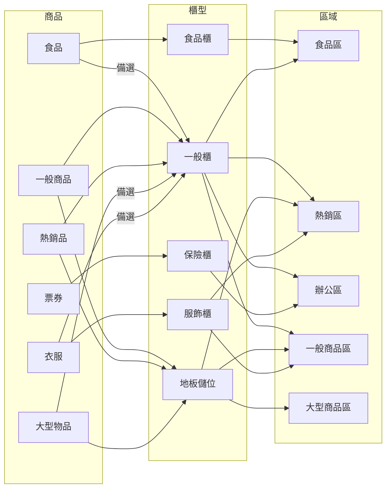

想像停車場：機車停機車格、休旅車要找大型車位、電動車得停有充電樁的區域——倉庫上架也是類似的配對，只是維度更多：什麼商品該放什麼區域、什麼尺寸的格位放得下，這些判斷大多鎖在資深上架人員的腦袋裡。新人來了只能跟著學，SOP 再多也記不住，結果不是卡住等人判斷，就是隨便找個空位塞進去，造成後續出貨效率下降

為了增加效率也減少新人上手的痛苦程度，我們決定讓系統來做最基本的判斷：根據商品特性和材積大小自動推薦合適的區域和尺寸，只有系統無法處理的複雜情境才需要請資深上架人員出手

那系統要怎麼判斷？拆開來看，倉庫裡本來就有三個不同的角色——商品、區域、尺寸——各自有各自的限制，只是過去全部混在人的判斷裡。把它們分開描述自己，再用一個配對引擎兜起來：


```mermaid
graph LR
    P[商品] -->|我屬於哪個區域| Z[區域]
    Z -->|我有哪些尺寸| S[尺寸]
```

新增一種商品類型？告訴系統「我屬於哪個區域」就好，通常只需要新增 class

要理解為什麼這樣設計，得先看看最直覺的做法會踩到什麼坑

## 最直覺的做法：寫死的配對規則

大部分人第一反應會這樣寫：

```php
function recommendShelves(Product $product): array
{
    if ($product->type === '食品') {
        if ($product->width <= 40 && $product->height <= 40) {
            return ['zone' => '食品區', 'shelf' => '食品櫃'];
        }
        return ['zone' => '食品區', 'shelf' => '一般櫃'];
    }

    if ($product->type === '票券') {
        return ['zone' => '辦公區', 'shelf' => '保險櫃'];
    }

    if ($product->type === '大型物品') {
        if ($product->volume > 60) {
            return ['zone' => '大型商品區', 'shelf' => '地板儲位'];
        }
        return ['zone' => '大型商品區', 'shelf' => '一般櫃'];
    }

    // ... 無窮無盡的 if-else
    // 每種商品 × 每種材積 × 每種櫃型 × 每個區域 = ?
}
```

這還只是商品對櫃型的判斷。加上「這個商品能不能進這個區域」的限制，實際的對應關係長這樣：


```mermaid
graph LR
    subgraph 商品
        P1[食品]
        P4[一般商品]
        P5[熱銷品]
        P7[大型物品]
        P9[票券]
        P10[衣服]
    end

    subgraph 櫃型
        S1[食品櫃]
        S2[一般櫃]
        S3[保險櫃]
        S4[地板儲位]
        S5[服飾櫃]
    end

    subgraph 區域
        Z1[食品區]
        Z2[熱銷區]
        Z3[辦公區]
        Z4[一般商品區]
        Z5[大型商品區]
    end

    P1 --> S1
    P1 -->|備選| S2
    P4 --> S2
    P4 --> S4
    P5 --> S2
    P5 --> S4
    P7 --> S4
    P7 -->|備選| S2
    P9 --> S3
    P10 --> S5
    P10 -->|備選| S2

    S1 --> Z1
    S2 --> Z1
    S2 --> Z2
    S2 --> Z3
    S2 --> Z4
    S3 --> Z3
    S4 --> Z2
    S4 --> Z4
    S4 --> Z5
    S5 --> Z4
    S5 --> Z2
```

每加一種商品，這張圖就再亂一點。而這些全部要用 if-else 寫出來（上面只列了幾種常見的商品和區域，實際還有地板區、雨傘區等更多類型）

這種寫法有三個痛點：

* **定位困難** 光是 PM 詢問某個商品為什麼不能放在 XX 櫃型，整理程式碼現況 + 實測商品/櫃型狀況可能就要花上大半天，還不一定能確認是設定問題還是 bug ，最後只好埋個 log 下次再追

* **影響範圍不可控** 在第 50 行加一個條件，可能影響到第 200 行的邏輯。即使嘗試用一些 function 隔離，也會因為一些特例需要跨 function 的判斷造成邊界混亂

* **測試組合爆炸** 上面只列了 3 種商品就已經這麼複雜，實際的商品類型、櫃型、區域更多——組合數會隨著任一維度的增加而相乘。每次改動測不完所有組合，上線後只能祈禱


## 退一步想：這三件事本來就該分開描述

讓我從實體倉庫的角度重新看這個問題

區域有自己的限制——不同區域有不同的環境條件和動線考量，決定了能擺哪些尺寸的櫃子。尺寸有自己的限制——格位大小、能不能容納商品的材積。商品也有自己的限制——材積、類型、存放需求，決定了它屬於哪些區域。像是同一種一般尺寸的櫃子可以放在食品區也可以放在一般區，但食品不會被推薦到辦公區——因為食品自己宣告不屬於那裡

它們各自有獨立的屬性，只是最後需要有人把它們配在一起。當然，程式碼裡這三個角色仍然會透過 class reference 互相指涉——`Food` 知道 `FloorZone`、`FoodZone`，`FoodZone` 知道自己有哪些 `Size`——但這種指涉是宣告式的，改動範圍可預測，而不是流程式的，牽一髮動全身

問題就出在：那一坨 if-else 同時在做三件事——描述商品屬於哪個區域、決定該用什麼尺寸、還要把兩者配在一起回傳。但從業務邏輯出發，這些應該拆開：商品先描述自己需要什麼存放環境（區域），再由區域列出可用的配置（尺寸），最後由引擎負責配對。環境是商品本身的存放需求，尺寸是區域內提供的選項

回頭看問題圖裡的「櫃型」，其實混合了兩個概念：

| 問題圖的櫃型 | 拆開後 |
|---|---|
| 食品櫃 | 食品區 + 食品尺寸 |
| 一般櫃 | 多個區域共用同一種尺寸規格（如 `SizeMiddle`），差別在商品宣告自己屬於哪個區域 |
| 保險櫃 | 辦公區 + 辦公尺寸 |
| 地板儲位 | 地板區 + 地板尺寸 |

一個「食品櫃」同時包含了「在哪個區域」和「尺寸規格」，拆開來才能各自獨立描述、獨立變動

而且換個思路——與其讓程式碼寫死一個答案，不如讓品項按優先順序逐一嘗試：找到第一個放得下的區域和尺寸就回傳，都放不下就明確報錯，由現場人員處理

拆開來就對了

## 讓每個角色自己說話

先定義每個角色需要描述什麼：

```php
interface ProductType
{
    /** 我屬於哪些區域 */
    public function requirements(): array;
}

interface Zone
{
    /** 我有哪些尺寸可用 */
    public function allowedSizes(): array;
}

interface Size
{
    /** 我能容納這個材積嗎 */
    public function available(Dimensional $dimension, int $pcs): bool;
}
```

三個 interface 就把整個系統的角色說清楚了。接著每個類型只要實作自己的描述：

```php
class Food implements ProductType
{
    public function requirements(): array { return [FloorZone::class, FoodZone::class]; }
}

class FoodZone implements Zone
{
    public function allowedSizes(): array { return [SizeFloor::class, SizeBig::class, SizeMiddle::class, SizeFood::class]; }
}

class SizeMiddle implements Size
{
    private const MAX_WIDTH = 40;
    private const MAX_HEIGHT = 40;

    public function available(Dimensional $dimension, int $pcs): bool
    {
        return $dimension->width() <= self::MAX_WIDTH && $dimension->height() <= self::MAX_HEIGHT;
    }
}

class SizeFood implements Size
{
    /** 食品櫃不限材積，只看商品類型 */
    public function available(Dimensional $dimension, int $pcs): bool { return true; }
}
```

商品說「我屬於哪些區域」，區域說「我有哪些尺寸可用」，尺寸說「我能不能容納這個材積」。每個 class 只負責描述自己的規則——配對引擎負責按優先順序串起來，找到第一個放得下的區域-尺寸組合

配對引擎對外只有一個接口：

```php
function resolveShelfCriteria(Product $product): array
{
    foreach ($product->type()->requirements() as $zoneClass) {
        foreach ((new $zoneClass)->allowedSizes() as $sizeClass) {
            if ((new $sizeClass)->available($product->dimension(), $product->pcs())) {
                return ['zone' => $zoneClass, 'size' => $sizeClass];
            }
        }
    }

    throw new NoMatchingShelf();
}
```

從商品出發：先問 `requirements()` 知道屬於哪些區域，再從那些區域的 `allowedSizes()` 逐一用 `available()` 確認材積放不放得下——找到第一個符合的區域-尺寸組合就回傳，全部都不符合就丟 exception。整個過程都是純規則推導，不碰資料庫

陣列順序就是優先級——引擎按順序嘗試，先跑完第一個區域的所有尺寸，都放不下才換下一個區域。拿到區域-尺寸組合後，查詢層再去資料庫撈符合條件的實體櫃位。如果實體櫃位都滿了，系統不會退回去試下一組——直接回傳空結果，交給現場人員判斷

## 這樣改之後

拆開之後還有一個好處——class 命名直接對應物流現場的詞彙。現場說「票券放辦公區」，程式碼裡就是 `Ticket::requirements()` 回傳 `[OfficeZone]`。用業務語言命名本來就是好習慣；這個設計讓這個習慣更容易落實——每個商品類型都有自己的 class，名字即規格，不容易被藏進一坨 if-else 的某個 branch 裡

舉個例子：今天要新增「雨傘」類型，只需要問物流人員這類型放在哪個區域、那個區域有哪些可用尺寸，即使是新人工程師也能輕鬆上手完成這個需求：

```php
class Umbrella implements ProductType
{
    public function requirements(): array { return [UmbrellaZone::class]; }
}

class UmbrellaZone implements Zone
{
    public function allowedSizes(): array { return [SizeUmbrella::class]; }
}

class SizeUmbrella implements Size
{
    public function available(Dimensional $dimension, int $pcs): bool
    {
        return $dimension->longestSide() > 390;
    }
}
```

不用打開任何既有的 if-else，不用改動食品或大型物品的邏輯。三個新 class，任何既有邏輯都不需要動

每個類型的單元測試變直覺了——每個 class 獨立測試自己的宣告，配對引擎只測比對邏輯。但這只是基礎，光靠單元測試還不夠；你還需要跨角色的一致性測試才能真正防護靜默失敗（後面會詳細說明）

上面的雨傘就是個真實案例——第一次接觸這個專案的工程師接到這個需求，改動集中在三個新 class，不需要動到任何既有邏輯。換成 if-else 的話，光是搞清楚新的 block 該放在最上面、最下面、還是某個判斷的後面——這件事本身就要求你先理解所有既有分支的順序和依賴

假設今天要新增「冷凍食品」，只需要建一個 `FrozenFood` class 宣告它屬於哪些區域——完全不用動任何既有 class：

```php
class FrozenFood implements ProductType
{
    public function requirements(): array { return [FloorZone::class, FoodZone::class]; }
}
```

你可能會注意到 `FrozenFood` 和 `Food` 的 `requirements()` 目前完全相同——那為什麼要拆成兩個 class？即使規則目前相同，獨立的 class 讓每個商品類型都有自己的一致性測試——當規則分歧時不會漏改

這種**改動範圍明確可預測**的特性才是這個設計真正的好處。比起在一坨 if-else 裡找到正確的插入點、還要擔心會不會影響其他分支——如果複用既有的 Zone 和 Size，新增一個商品類型只需要新增一個 class；即使需要新的區域和尺寸（像雨傘），也就是三個互不影響的小 class

## 但這不是銀彈

### 靜默失敗風險

這個設計把複雜度從「一坨 if-else」搬到了「每個 class 的宣告正確性」。兩種典型的靜默失敗：

* `FrozenFood` 的 `requirements()` 漏寫了 `FoodZone::class`——配對引擎不會報錯，只是默默跳過食品區，推薦一個不太合理的位置
* `FoodZone` 的 `allowedSizes()` 裡有人把 `SizeFood`（永遠回傳 true）移到 `SizeFloor` 前面——所有食品都會被配到食品尺寸，地板尺寸永遠輪不到
* 在 `FoodZone::allowedSizes()` 加入新尺寸時，所有屬於該區域的商品都會多一個候選——如果新尺寸的 `available()` 判斷不夠嚴格，不該配到這個尺寸的商品也會被配上去

if-else 一樣會靜默失敗——改錯 branch、優先級順序放反，系統也是照常跑但結果不對，而且因為邏輯全部擠在同一個 function 裡，測試不好寫、code review 也很難看出來。自我描述模式下靜默失敗的形狀不同：問題從「改錯某一行」變成「漏寫某個宣告」，但至少每個 class 可以獨立測試

### 一致性測試

對付這個問題，靠的是**期望配對測試**——直接用 `assertEquals` 驗證每個商品類型的 `requirements()` 回傳值，例如斷言 `FrozenFood` 必須回傳 `[FloorZone, FoodZone]`。`allowedSizes()` 的順序也可以用同樣方式守住

代價是每次新增類型時，除了寫 class 還要在測試裡加一行期望。如果工程師兩邊都忘了寫，測試不會失敗——最終防線是 code review

### 兩種做法的 trade-off

| | if-else | 自我描述模組 |
|---|---|---|
| **新增類型** | 要在一坨邏輯裡找對位置插入 | 通常只需要新增 class；若新類型需要現有區域支援新尺寸，則改一行既有 Zone（例如在 `FoodZone::allowedSizes()` 加入 `SizeCold::class`） |
| **出錯方式** | 改錯一行影響全域，邏輯集中但順序和完整性一目了然 | 漏寫宣告不會報錯，改動隔離但順序隱藏在陣列裡 |
| **定位問題** | 所有邏輯集中在一個 function，讀完即全貌 | 宣告分散在多個 class，要逐一檢查是否一致 |

沒有哪一種絕對更好。if-else 在規則少的時候直覺好懂；自我描述在規則多、變動頻繁的時候讓改動範圍可預測。選哪個取決於你的系統有多少種商品類型、多常新增，以及團隊能不能維持一致性測試的紀律

## 最後

上線後大部分常見的商品類型，系統都能直接給出推薦的區域-尺寸組合——不用再從零開始想要放哪裡。少數系統配不上的例外情境才需要現場人員介入。核心就一句話：讓每個模組只需要描述自己，配對的事交給引擎
